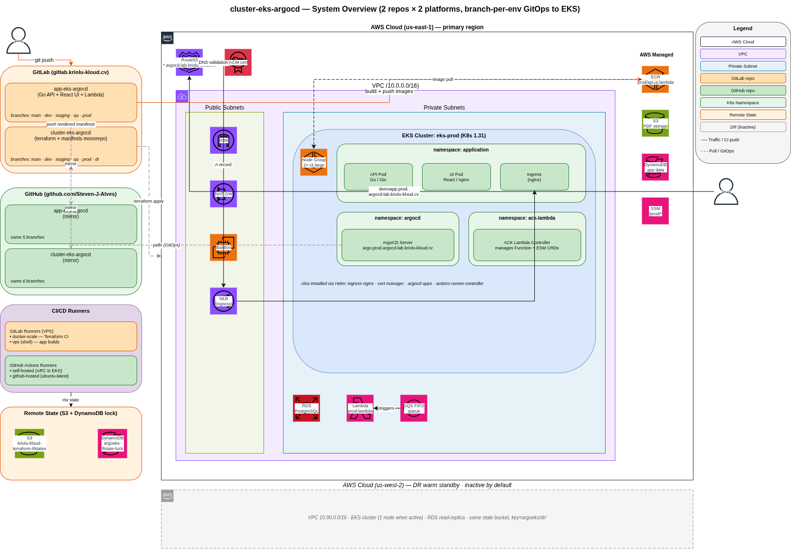
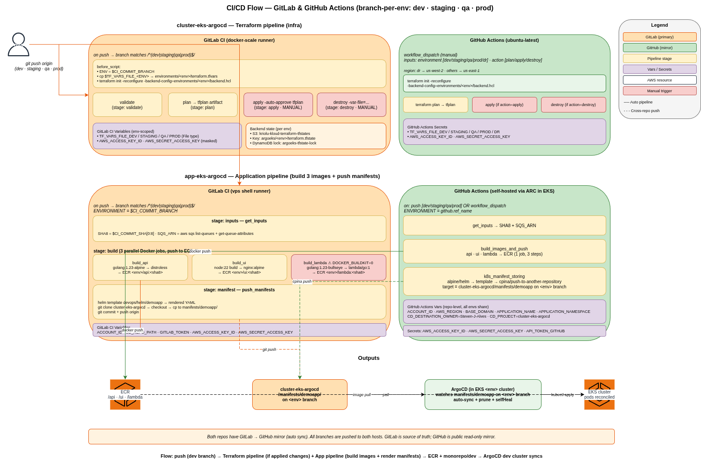

# cluster-eks-argocd

Mono-repo for the **EKS + ArgoCD** GitOps platform: Terraform code that provisions the AWS infrastructure and the Kubernetes manifests that ArgoCD watches and reconciles.

The demo application code lives in a **separate** repo: [`app-eks-argocd`](https://gitlab.kriolu-kloud.cv/kriolu-kloud/apps-for-deploy/app-eks-argocd) (GitLab) / [`Steven-J-Alves/app-eks-argocd`](https://github.com/Steven-J-Alves/app-eks-argocd) (GitHub).

## System overview



## CI/CD flow



## Repository layout

```
cluster-eks-argocd/
├── terraform/               # AWS infrastructure (EKS, VPC, RDS, Lambda, SQS, ECR, S3 …)
│   ├── modules/             # thin wrappers around registry modules
│   ├── cluster/             # composition — .tf files calling modules
│   │   └── environments/    # per-env tfvars + backend.hcl (dev/staging/qa/prod/dr)
│   └── scripts/
├── manifests/               # Kubernetes manifests, one folder per app
│   └── demoapp/             # rendered YAML pushed here by app-eks-argocd CI
├── architecture.drawio      # overall system diagram
├── cicd-flow.drawio         # detailed CI/CD flow (GitLab + GitHub)
└── README.md
```

## The GitOps loop (3 pieces, 2 repos)

```
┌─ app-eks-argocd (separate repo) ─────────┐   ┌─ cluster-eks-argocd (this repo) ────────────────┐
│                                          │   │                                                 │
│  push commit → CI:                       │   │   terraform/  →  provisions cluster + ArgoCD   │
│    build 3 Docker images → ECR           │   │                                                 │
│    helm template → git push ─────────────┼───┤→  manifests/demoapp/  ← updated by CI          │
│                                          │   │                    ↓                            │
└──────────────────────────────────────────┘   │              ArgoCD detects change             │
                                               │                    ↓                            │
                                               │              kubectl apply → EKS cluster       │
                                               └─────────────────────────────────────────────────┘
```

## Branch-per-env

Both repos share the same branch layout. Push to a branch = deploy to that env.

| Branch  | Env      | AWS region  | Notes                                    |
|---------|----------|-------------|------------------------------------------|
| `main`  | —        | —           | default, PR reviews, no auto-deploy      |
| `dev`   | dev      | us-east-1   | 1× t3.medium, small footprint            |
| `staging` | staging | us-east-1   | mirrors prod topology at smaller scale   |
| `qa`    | qa       | us-east-1   | 2× t3.medium for QA validation           |
| `prod`  | prod     | us-east-1   | 2× t3.large, live traffic                |
| `dr`    | dr       | **us-west-2** | *(terraform only)* warm standby, off by default |

Each env has its own S3 state file (via `backend.hcl`) — isolated blast radius.

## Infrastructure overview

| Component           | Technology                                                    |
|---------------------|---------------------------------------------------------------|
| Cloud               | AWS us-east-1 (us-west-2 for DR)                              |
| Cluster             | EKS (Kubernetes 1.31), managed node group                     |
| Networking          | VPC (10.0.0.0/16 prod, unique per env), public + private subnets, NAT Gateway, NLB |
| Container registry  | ECR — `<env>/api`, `<env>/ui`, `<env>/lambda`                 |
| Database            | RDS PostgreSQL (private subnet)                               |
| Serverless          | AWS Lambda (OCI image, managed via ACK Lambda Controller)     |
| Queue               | SQS FIFO (triggers Lambda via EventSourceMapping)             |
| Storage             | S3 (PDF output files)                                         |
| Config              | SSM Parameter Store (`/<env>/*`)                              |
| DNS / TLS           | Route53 + ACM wildcard certificate                            |
| GitOps operator     | ArgoCD 7.x                                                    |
| IaC                 | Terraform 1.13, S3 backend + DynamoDB state lock              |

## CI/CD platforms

Both are configured, choose whichever fits your workflow:

| Platform         | Trigger                                    | Runner                                       |
|------------------|--------------------------------------------|----------------------------------------------|
| GitLab CI        | Auto on push to `dev` / `staging` / `qa` / `prod` | `docker-scale` (Docker-in-container) + `vps` (shell) |
| GitHub Actions   | Push OR `workflow_dispatch`                | self-hosted (ARC) or GitHub-hosted            |

Both share the same S3 state — DynamoDB locking prevents concurrent runs.

For a detailed view see `cicd-flow.drawio`.

## Quick start

Requires: `terraform >= 1.9`, `aws` CLI with a profile that has admin on the target account.

```bash
cd terraform/cluster

# 1. Copy the tfvars template for your env and fill in real values
cp environments/prod/terraform.tfvars.example environments/prod/terraform.tfvars

# 2. Initialise with the env-specific backend
AWS_PROFILE=steven-prod terraform init -reconfigure \
  -backend-config=environments/prod/backend.hcl

# 3. Plan + apply
AWS_PROFILE=steven-prod terraform plan  -var-file=environments/prod/terraform.tfvars
AWS_PROFILE=steven-prod terraform apply -var-file=environments/prod/terraform.tfvars
```

First-time provisioning takes **~20 minutes** (EKS control plane + RDS are the slow bits). ArgoCD, ingress-nginx, cert-manager, ACK Lambda are all installed via Helm during the same apply.

## Destroy

```bash
cd terraform/cluster
AWS_PROFILE=steven-prod terraform destroy \
  -var-file=environments/prod/terraform.tfvars
```

Takes ~15 minutes. After the destroy completes, run `./scripts/detect-orphans.sh` to check for leftover AWS resources not in state.

> **Cost notice**: EKS + RDS + NAT Gateway ≈ **$5-10/day** when running. Destroy when not needed.

## Application endpoints (once deployed to `prod`)

| URL                                                    | Description               |
|--------------------------------------------------------|---------------------------|
| `https://demoapp.prod.argocd-lab.kriolu-kloud.cv/`     | Web UI (React 19 + Vite)  |
| `https://demoapp.prod.argocd-lab.kriolu-kloud.cv/api/version` | API version check         |
| `https://argo.prod.argocd-lab.kriolu-kloud.cv/`        | ArgoCD dashboard          |

## Documentation index

| File                                       | What it covers                              |
|--------------------------------------------|---------------------------------------------|
| `README.md` (this file)                    | Overview + quick start                      |
| `terraform/README.md`                      | Terraform layout, modules, state hygiene    |
| `terraform/cluster/environments/README.md` | How environments work + how to switch       |
| `manifests/README.md`                      | GitOps manifest structure                   |
| `architecture.drawio`                      | System overview diagram                     |
| `cicd-flow.drawio`                         | CI/CD pipeline flow (GitLab + GitHub)       |
