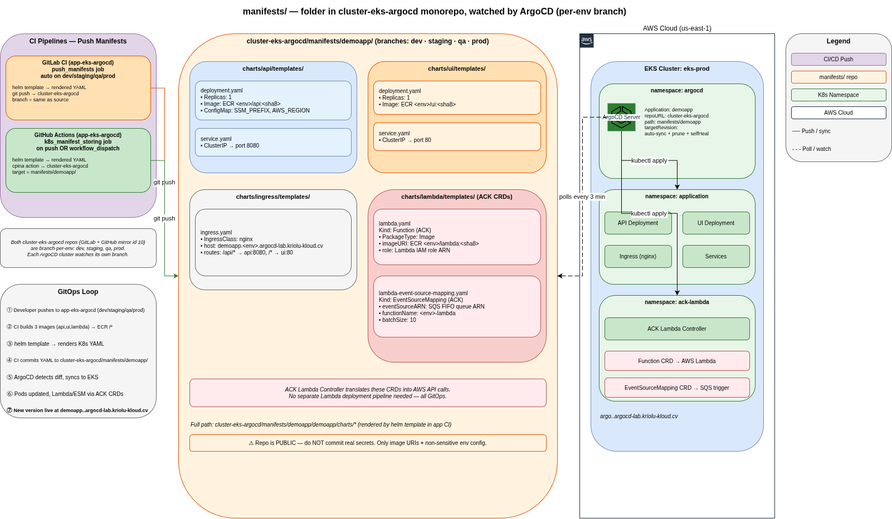

# manifests

Rendered Kubernetes manifests, watched by ArgoCD. **Never edited by hand** — the CI pipeline in [`app-eks-argocd`](https://gitlab.kriolu-kloud.cv/kriolu-kloud/apps-for-deploy/app-eks-argocd) writes here after every successful build.

## Architecture



## How this folder gets updated

```
app-eks-argocd CI (on push to <env> branch)
   └─ build 3 Docker images → push to ECR
   └─ helm template demoapp → renders K8s YAML
   └─ git clone cluster-eks-argocd (this repo)
   └─ checkout <env> branch (create if missing)
   └─ overwrite manifests/demoapp/
   └─ git push → this repo's <env> branch
        └─ ArgoCD (running in the <env> cluster) polls this branch
             └─ detects diff
             └─ kubectl apply → EKS
```

- **GitLab CI** clones this repo via HTTPS with `$GITLAB_TOKEN`.
- **GitHub Actions** uses `cpina/github-action-push-to-another-repository` with `$API_TOKEN_GITHUB`.

## Branch-per-env

ArgoCD in each cluster watches its own branch here:

| Branch    | Watched by                    |
|-----------|-------------------------------|
| `main`    | nobody (integration only)     |
| `dev`     | ArgoCD in dev cluster         |
| `staging` | ArgoCD in staging cluster     |
| `qa`      | ArgoCD in qa cluster          |
| `prod`    | ArgoCD in prod cluster        |

Auto-sync, pruning, and self-heal are enabled on every ArgoCD `Application`.

## Directory layout

```
manifests/
└── demoapp/
    └── demoapp/
        └── charts/
            ├── api/templates/
            │   ├── deployment.yaml           # Go API — image ECR <env>/api:<sha8>
            │   ├── configmap.yaml            # SSM_PREFIX, AWS_REGION
            │   ├── service.yaml              # ClusterIP → port 8080
            │   ├── serviceaccount.yaml
            │   ├── hpa.yaml                  # Horizontal Pod Autoscaler
            │   └── tests/
            ├── ui/templates/
            │   ├── deployment.yaml           # React UI — image ECR <env>/ui:<sha8>
            │   ├── configmap.yaml
            │   ├── service.yaml
            │   └── serviceaccount.yaml
            ├── ingress/templates/
            │   └── ingress.yaml              # nginx IngressClass, TLS, host routing
            └── lambda/templates/
                ├── lambda.yaml                       # ACK Function CRD (OCI image)
                └── lambda-event-source-mapping.yaml  # ACK EventSourceMapping (SQS → Lambda)
```

## Kubernetes namespaces (in the target cluster)

| Namespace     | Contents                                                                    |
|---------------|-----------------------------------------------------------------------------|
| `application` | API Deployment, UI Deployment, Ingress                                      |
| `ack-lambda`  | ACK Lambda Controller (translates `Function`/`EventSourceMapping` CRs → AWS API) |
| `argocd`      | ArgoCD server + agents                                                      |

## ACK Lambda CRDs

Lambda runs as an AWS-managed function *outside* the cluster. To keep it inside the GitOps loop, the **ACK Lambda Controller** translates two Kubernetes custom resources into AWS API calls:

- `Function` (CRD) → AWS Lambda function (image from ECR)
- `EventSourceMapping` (CRD) → SQS → Lambda trigger

This means updating the Lambda image is as simple as committing a new `lambda.yaml` with an updated `imageURI`. No separate Lambda deployment pipeline needed.

## Editing directly (don't do it)

If you edit files here manually and push, ArgoCD will apply your changes. But the next CI run from `app-eks-argocd` will **overwrite** them. Any hand-edit is temporary.

For persistent changes: edit the Helm chart in [`app-eks-argocd/devops/helm/demoapp/`](https://gitlab.kriolu-kloud.cv/kriolu-kloud/apps-for-deploy/app-eks-argocd/-/tree/main/devops/helm/demoapp) and let the pipeline regenerate.

> **Note**: this folder is inside a monorepo — the whole `cluster-eks-argocd` is currently public. Do NOT commit real secrets here.
