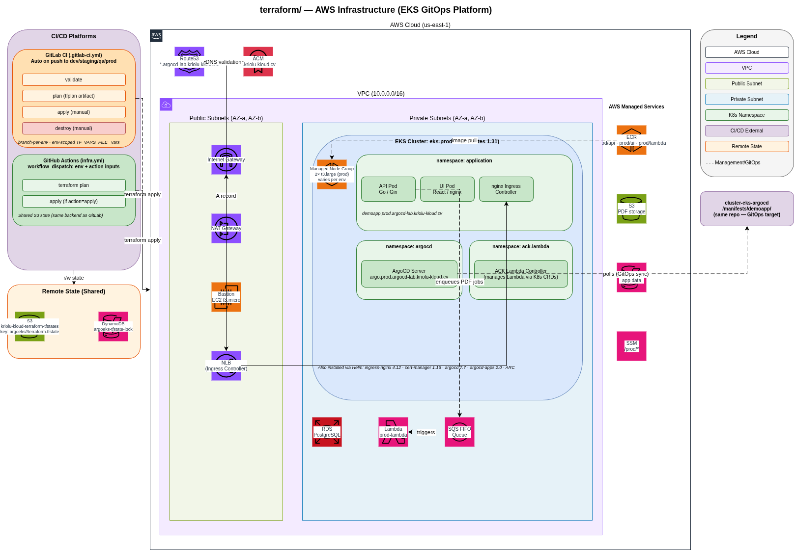

# terraform

AWS infrastructure for the EKS GitOps platform. Terraform ≥ 1.9 (CI runs 1.13.3), provider `hashicorp/aws ~> 5.35` (resolves to 5.100+).

## Architecture



## Layout

```
terraform/
├── modules/                     # Reusable local modules (thin wrappers around registry modules)
│   ├── vpc/                     # → terraform-aws-modules/vpc/aws
│   ├── eks/                     # → terraform-aws-modules/eks/aws
│   ├── rds/                     # → cloudposse/rds-cluster/aws (+ random passwords, SSM)
│   ├── ecr/                     # → cloudposse/ecr/aws
│   ├── s3/                      # → terraform-aws-modules/s3-bucket/aws (+ SSM)
│   ├── sqs/                     # → terraform-aws-modules/sqs/aws (+ SSM)
│   ├── dynamodb/                # → terraform-aws-modules/dynamodb-table/aws (+ SSM)
│   ├── iam-lambda/              # → terraform-aws-modules/iam (role + policy + SSM)
│   ├── bastion/                 # EC2 + SG + EIP + key pair + AMI lookup
│   └── acm-route53/             # ACM cert + DNS validation + wildcard record + bastion record
│
├── cluster/                     # Root Terraform stack (composition layer)
│   ├── vpc.tf                   # calls modules/vpc
│   ├── eks.tf                   # calls modules/eks
│   ├── rds.tf                   # calls modules/rds
│   ├── data-stores.tf           # calls modules/{ecr,s3,sqs,dynamodb}
│   ├── lambda-iam.tf            # calls modules/iam-lambda
│   ├── bastion.tf               # calls modules/bastion
│   ├── dns-tls.tf               # calls modules/acm-route53 + reads ingress NLB
│   ├── helm.tf                  # all helm_release blocks (ArgoCD, ingress-nginx, cert-manager, ACK, ARC)
│   ├── kubernetes.tf            # namespaces + ArgoCD repo secret
│   ├── data.tf                  # aws_caller_identity
│   ├── locals.tf                # cluster_name
│   ├── providers.tf             # aws + kubernetes + helm (with exec plugin)
│   ├── variables.tf             # inputs
│   ├── versions.tf              # required_version + required_providers + backend
│   ├── crd-helm-chart/          # local Helm chart (RunnerDeployment CR for ARC)
│   ├── helm-chart-values/       # values.yaml files for helm_releases
│   └── environments/
│       └── prod/
│           └── terraform.tfvars # gitignored — actual values
│
└── scripts/
    └── detect-orphans.sh        # scan AWS for resources tagged Project=DemoApp
```

## State backend

Remote state in S3 with DynamoDB locking. Shared between GitLab CI and GitHub Actions — only one apply can run at a time.

The `key` is supplied per-env via `-backend-config=environments/<env>/backend.hcl`:

```hcl
# versions.tf — partial config (no key)
backend "s3" {
  bucket         = "kriolu-kloud-terraform-tfstates"
  region         = "us-east-1"
  dynamodb_table = "argoeks-tfstate-lock"
  encrypt        = true
}
```

```hcl
# environments/prod/backend.hcl
key = "argoeks/prod/terraform.tfstate"
```

Each env has its own state file: `argoeks/dev/`, `argoeks/staging/`, `argoeks/qa/`, `argoeks/prod/`, `argoeks/dr/`.

**Protections in place:**
- S3 versioning: **enabled** — any state file version can be restored via `aws s3api list-object-versions`
- DynamoDB locking: **active** — concurrent runs blocked
- Backend key is fixed in `versions.tf` — do not change it

## Running

```bash
cd cluster/
terraform init -reconfigure -backend-config=environments/prod/backend.hcl
terraform plan  -var-file=environments/prod/terraform.tfvars
terraform apply -var-file=environments/prod/terraform.tfvars
```

Switch env: change `prod` → `dev` / `staging` / `qa` / `dr` in both `-backend-config=...` and `-var-file=...`. Always use `-reconfigure` when changing envs.

The CI pipelines copy the appropriate tfvars file (from `TF_VARS_FILE_<ENV>` GitLab CI Variable / GitHub Actions Secret) into `environments/<env>/terraform.tfvars` before running.

## State hygiene rules (don't break these — that's how orphans happen)

**What causes orphans:** resources exist in AWS but are missing from Terraform state, so `destroy` cannot remove them.

1. **Never manually delete `.terraform/`, `.terraform.lock.hcl`, or state files while a run is in progress.** If a run is stuck, either wait or check the DynamoDB lock table and force-unlock only when you're sure no one else is running.
2. **Never change the S3 backend `key`** after resources are provisioned. If you must move state, use `terraform state pull` → new backend → `terraform state push`.
3. **Never run `terraform apply` with a partial `.terraform/` cache** (e.g. after copying files around). Always run `terraform init -reconfigure` first.
4. **Never use `-refresh=false` for destroy** unless you know exactly what you're doing. It skips reading real infra state, and can miss resources.
5. **If an apply fails halfway, run apply again to converge** — do NOT run destroy and re-apply. Half-applied resources not in state become orphans on destroy.
6. **If you delete the state file to "start fresh," you MUST manually clean AWS first** — use the orphan detection script (below).

## Detecting orphans

```bash
AWS_PROFILE=steven-prod ./scripts/detect-orphans.sh
```

Lists all AWS resources tagged `Project=DemoApp` (or matching common naming patterns). Cross-check against `terraform state list` — anything in AWS but not in state is an orphan.

## Modules

Each module in `modules/` follows the pattern:

- `main.tf` — calls the registry module as `module.this` (thin wrapper)
- `variables.tf` — curated inputs
- `outputs.tf` — what the composition layer needs

Local modules make version bumps and shared configuration easy. Registry modules are pinned with `~>` so we get patch updates automatically without breaking major-version compatibility.

## Branch-per-env workflow

Both this repo and [`app-eks-argocd`](https://gitlab.kriolu-kloud.cv/kriolu-kloud/apps-for-deploy/app-eks-argocd) share the same branch layout:

| Branch    | Role                                                       |
|-----------|------------------------------------------------------------|
| `main`    | default — feature integration, PR reviews, no auto-deploy  |
| `dev`     | push here → deploy to `dev` env                            |
| `staging` | push here → deploy to `staging` env                        |
| `qa`      | push here → deploy to `qa` env                             |
| `prod`    | push here → deploy to `prod` env                           |
| `dr`      | *(this repo only)* deploy to DR region on demand           |

Rule of thumb:
- Develop on feature branches → merge to `main`
- Promote: `main → dev → staging → qa → prod`
- Each env has its own S3 state, its own tfvars, its own AWS resources

### GitLab CI Variables for the terraform pipeline (this repo)

| Variable                                        | Type              | Contents                                            |
|-------------------------------------------------|-------------------|-----------------------------------------------------|
| `TF_VARS_FILE_DEV`                              | File              | dev `terraform.tfvars` contents                     |
| `TF_VARS_FILE_STAGING`                          | File              | idem for staging                                    |
| `TF_VARS_FILE_QA`                               | File              | idem for qa                                         |
| `TF_VARS_FILE_PROD`                             | File              | idem for prod                                       |
| `AWS_ACCESS_KEY_ID` / `AWS_SECRET_ACCESS_KEY`   | Variable (masked) | AWS credentials                                     |

### GitLab CI Variables for the app pipeline (`app-eks-argocd`)

| Variable                                        | Type              | Contents                                                |
|-------------------------------------------------|-------------------|---------------------------------------------------------|
| `ACCOUNT_ID`                                    | Variable (masked) | AWS account ID (e.g. `598552768939`)                    |
| `CD_REPO_PATH`                                  | Variable          | `kriolu-kloud/devops/eks/cluster-eks-argocd`            |
| `GITLAB_TOKEN`                                  | Variable (masked) | PAT with write access to this repo                      |
| `AWS_ACCESS_KEY_ID` / `AWS_SECRET_ACCESS_KEY`   | Variable (masked) | AWS credentials                                         |

### GitHub Actions equivalents

**Terraform (this repo):**  `TF_VARS_FILE_<ENV>`, `AWS_ACCESS_KEY_ID`, `AWS_SECRET_ACCESS_KEY` as **Secrets**.

**App (`app-eks-argocd`):**  `AWS_*` + `API_TOKEN_GITHUB` as **Secrets**;  `ACCOUNT_ID`, `AWS_REGION`, `BASE_DOMAIN`, `APPLICATION_NAME`, `APPLICATION_NAMESPACE`, `CD_DESTINATION_OWNER=Steven-J-Alves`, `CD_PROJECT=cluster-eks-argocd` as **Variables**.

## Destroying

```bash
cd cluster/
terraform destroy -var-file=environments/prod/terraform.tfvars
```

**Takes ~15 minutes.** After destroy, run `./scripts/detect-orphans.sh` to confirm nothing dangling.

> **Cost warning**: EKS + RDS + NAT Gateway = ~$5-10/day when running. Destroy when not in use.
